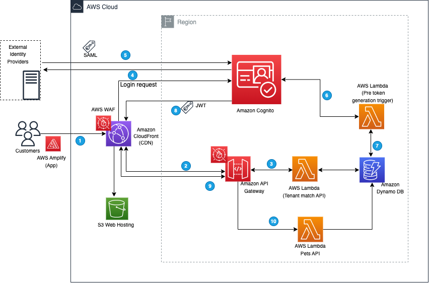

# Use Amazon Cognito with identify federation to support a multi-tenant business to business application with a single User Pool

## Overview

This sample is the companion code to the blog posts “[Learn to use SAML with Amazon Cognito to support a multi-tenant application with a single User Pool](https://aws.amazon.com/blogs/security/use-saml-with-amazon-cognito-to-support-a-multi-tenant-application-with-a-single-user-pool/)“ and Use OIDC custom attributes with Amazon Cognito to support a multi-tenant application.  This example can be used as a starting point for deploying a single Cognito User Pool together with multiple external identity providers (IdP).  

With this sample your customers can use the same URL to access your application. You set up each new customer by configuring [Security Assertion Markup Language (SAML)](https://docs.aws.amazon.com/cognito/latest/developerguide/cognito-user-pools-saml-idp.html) or [OpenID Connect (OIDC)](https://docs.aws.amazon.com/cognito/latest/developerguide/cognito-user-pools-oidc-idp.html) integration with your customer’s external identity provider (IdP).  By controlling access to your application using an external identity store, such as [Google Workspace](https://workspace.google.com/), [OKTA](https://www.okta.com/), [Microsoft Entra ID](https://www.microsoft.com/en-us/security/business/identity-access/microsoft-entra-id),  or [Active Directory Federation Service (AD FS)](https://learn.microsoft.com/en-us/windows-server/identity/active-directory-federation-services) your customers can create, manage, and revoke access for their users. 

Once federated identity integration is configured, the user authentication process creates a [JSON web token (JWT)](https://tools.ietf.org/html/rfc7519) in the user’s browser containing attributes the application can use for authorization and access control. The token contains claims about the identity of the authenticated user, such as `name` and `email`. You can use this identity information inside your application. You can also add custom attributes to be populated in the JWT such as `tenantName and usergroups`.

This repository contains all that is needed in order to create a serverless web application with Amazon Cognito, Amazon API Gateway, AWS Lambda and Amazon DynamoDB.

* **Amazon API Gateway**: Amazon API Gateway is a fully managed service that makes it easy for developers to create, publish, maintain, monitor, and secure APIs at any scale. Combined with [Amazon Cognito User Pools Authorizer](https://docs.aws.amazon.com/apigateway/latest/developerguide/apigateway-integrate-with-cognito.html) - it handles validation of the user's tokens.
* **AWS Lambda**: AWS Lambda lets you run code without provisioning or managing servers. You pay only for the compute time you consume - there is no charge when your code is not running. This is the serverless compute service that runs the backend of our app (behind Amazon API Gateway). requests are only forwarded if the user is authenticated and has a valid JWT token.
* **Amazon Cognito User Pools**: Amazon Cognito lets you add user sign-up, sign-in, and access control to your web and mobile apps quickly and easily. Amazon Cognito scales to millions of users and supports sign-in with social identity providers, such as Facebook, Google, and Amazon, and enterprise identity providers via SAML 2.0.
* **Amazon DynamoDB**: Amazon DynamoDB is a serverless key-value and document database that delivers single-digit millisecond performance at any scale. It is used as the persistence storage layer for our example application.

## Modules

The sample contains the following modules within these sub-folders:

### /cloudformationtemplate

This example can be deployed using [AWS CloudFormation](https://docs.aws.amazon.com/AWSCloudFormation/latest/UserGuide/Welcome.html).

You may deploy this template in your AWS account and it will create all the resources needed in order to create the sample application. When prompted please enter a stack name and a unique bucket name for a new bucket that will be created by the stack.

Once the CloudFormation script is successfully executed, you will be able to capture all the output parameters that you would need to complete the setup.

Here are the key output parameters that you need to test the example application.

UI Url:   This is the URL you can open in your browser to test the application. 

CognitoDomainOutput and UserPoolIdOutput: These are needed for IdP configuration.

Additional setup is required. For complete instructions please refer to the blog post referenced above.

### /ui-react

A simple React frontend that connects to the backend API.   It employs [AWS Amplify](https://aws-amplify.github.io/) that provides [react and other components](https://aws-amplify.github.io/docs/js/start?platform=react) for simpler integration with various AWS services from web and mobile applications. AWS Amplify can manage all aspects of a project, but since AWS Cloud Development Kit (AWS CDK) was used, a [manual setup](https://aws-amplify.github.io/docs/js/authentication#manual-setup) process was followed.

## Tenant Configuration 

CloudFormattion will create three DynamoDB tables in your AWS account. You need to add tenant details in TenantTable. The TenantTable holds the tenant details where you can store mapping between the customer domain and the IdP ID Setup in Cognito.   Please refer to the blog post to add the TenantDetail with IDP id, that you will create in  Amazon Cognito.

## IdP Configuration Instructions

* **OKTA:**
    * Please refer to [this link](https://github.com/aws-samples/amazon-cognito-example-for-external-idp/blob/master/docs/OktaInstructions.md) to setup OKTA as a SAML IDP provider under client application web.
    * Please refer to [this link](https://help.okta.com/en-us/content/topics/apps/apps_app_integration_wizard_oidc.htm) to setup OKTA as an OIDC IDP provider under client application web.
* **Microsoft**:
    * Please refer to [this link](https://aws.amazon.com/premiumsupport/knowledge-center/cognito-ad-fs-saml/) to setup ADFS as a SAML IDP provider under client application web.
    * Please refer to [this link](https://learn.microsoft.com/en-us/entra/identity-platform/v2-protocols-oidc) to setup ADFS as an OIDC IDP provider under client application web.
* **Google Workspace:**
    * Please refer to [this link](https://github.com/aws-samples/amazon-cognito-example-for-multi-tenant/blob/main/docs/GoogleInstructions.md) to setup Google Workspace as a SAML IDP provider under client application web.
    * Please refer to [this link](https://developers.google.com/identity/openid-connect/openid-connect#appsetup) to setup Google Workspace as an OIDC IDP provider under client application web.

## Related Resources

* [Role-based access control using Amazon Cognito and an external identity provider](https://aws.amazon.com/blogs/security/role-based-access-control-using-amazon-cognito-and-an-external-identity-provider/)
* [AWS re:Inforce 2019: Identity and Access Control for Custom Enterprise Applications (SDD412)](https://www.youtube.com/watch?v=VZzx15IEj7Y) 
* Learn to use SAML with Amazon Cognito to support a multi-tenant application with a single User Pool

## Security

See [CONTRIBUTING](CONTRIBUTING.md#security-issue-notifications) for more information.

## License

This library is licensed under the MIT-0 License. See the LICENSE file.
    
