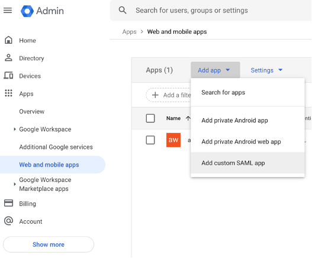
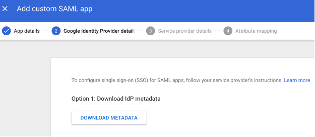
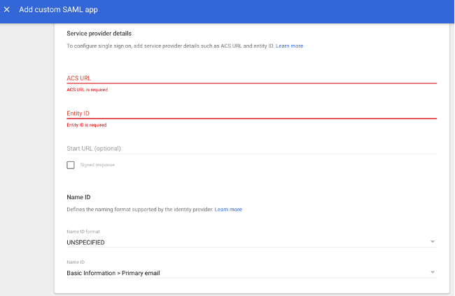
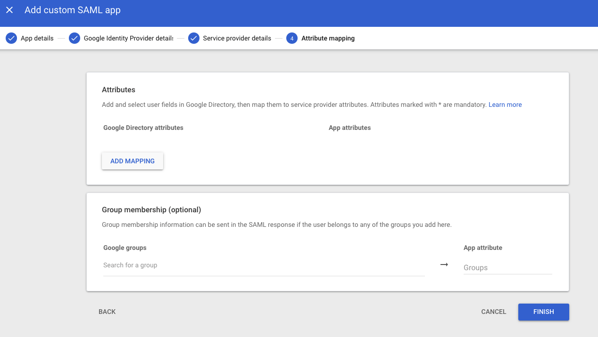
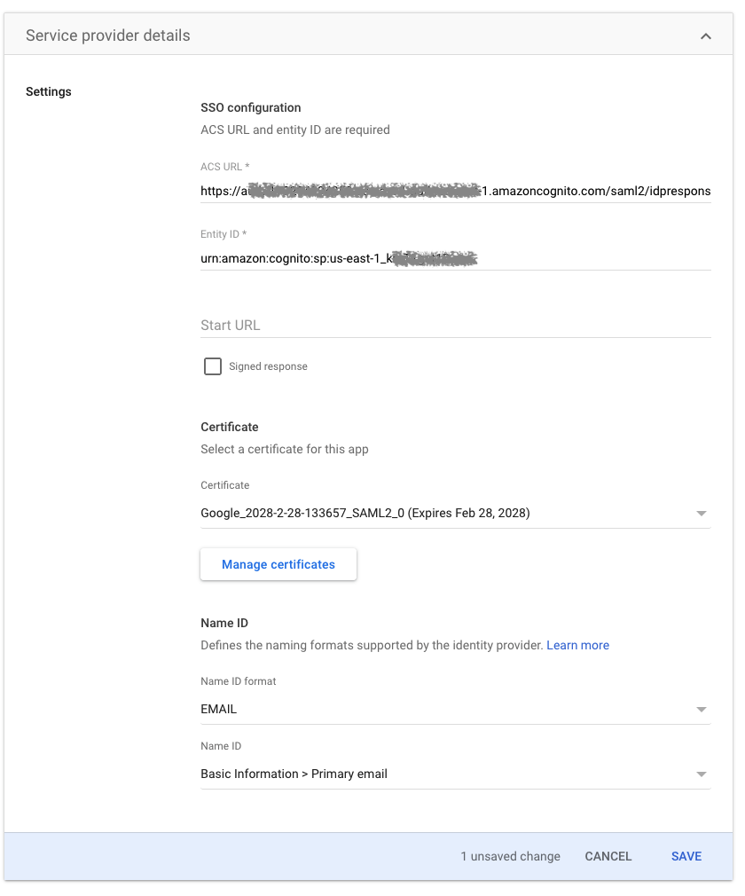

# **How to set up Google Workspace as a SAML identity provider with an Amazon Cognito user pool**

**Use these instructions to configure Google Workspace as a Security Assertion Markup Language 2.0 (SAML 2.0) identity provider (IdP) with an** [**Amazon Cognito user pool.**](https://docs.aws.amazon.com/cognito/latest/developerguide/cognito-user-identity-pools.html)

Amazon Cognito user pools allow sign-in through third party IdPs such as Google Workspace. For more information, see [Adding user pool sign-in through a third party](https://docs.aws.amazon.com/cognito/latest/developerguide/cognito-user-pools-identity-federation.html) and [adding SAML identity providers to a user pool](https://docs.aws.amazon.com/cognito/latest/developerguide/cognito-user-pools-saml-idp.html).

To set up Google Workspace as SAML IdP, you need an Amazon Cognito user pool and a Google Workspace account with an application.

## **Create an Amazon Cognito user pool**

For more information and instructions, see these articles:

- [Tutorial: creating a user pool](https://docs.aws.amazon.com/cognito/latest/developerguide/tutorial-create-user-pool.html)
- [Setting up the hosted UI with the Amazon Cognito Console](https://docs.aws.amazon.com/cognito/latest/developerguide/cognito-user-pools-app-integration.html#cognito-user-pools-create-an-app-integration)
- [Adding a domain name for your user pool](https://docs.aws.amazon.com/cognito/latest/developerguide/cognito-user-pools-domain.html)

**Note:** When creating a user pool, the standard attribute **email** is selected by default. For more information about user pool attributes, see [Configuring user pool attributes](https://docs.aws.amazon.com/cognito/latest/developerguide/user-pool-settings-attributes.html).

## **Create a Google Workspace account**

For more information, see the [Google Workspace website,](https://workspace.google.com/) and create a account.

**Create a Google Workspace application**

1. Once you setup the account and login choose **Web and mobile app** under **Apps** on the left side of the page, and click the **Add custom SAML app** under **Add app**.



2.    Enter the App name and description and click continue.

3.    Download IdP metadata as you will need it to configure Amazon Cognito and click Continue.



4.    Next you will have to enter the ACS URL and Entity ID that you can get from Cognito User pool setup and click Continue.



5.    Click Finish to complete.



## **Edit your Google Workspace application configuration**

On the **Service provider details** page, do the following:

1.  Confirm **ACS (Consumer) URL** is correct [**https://\<yourDomainPrefix\>.auth.region.amazoncognito.com/saml2/idpresponse**](https://yourDomainPrefix.auth.region.amazoncognito.com/saml2/idpresponse)

2.  Confrim **Entity ID** is correct **urn:amazon:cognito:sp:\<yourUserPoolId\>**

3.  Leave **Start URL** blank

4.  Select EMAIL from the drop down menu for **Name ID Format**

5.  Select  Primary email from the drop down menu for **Name ID**

>**Note:** For **Entity ID** , replace **\<yourUserPoolId\>** with your Amazon Cognito user pool ID. Find the ID in the [Amazon Cognito console](https://console.aws.amazon.com/cognito/) in the **General settings** tab of the management page for your user pool. For **ACS URL** , replace **\<yourDomainPrefix\>** and **region** with the values for your user pool. Find them in the Amazon Cognito console on the **Domain name** tab of the management page for your user pool.



## **Edit your Google Workspace Attributes mapping**

1. Select Primary email for the first attribute and the **App attributes** value as ```http://schemas.xmlsoap.org/ws/2005/05/identity/claims/email```

2.    Choose **ADD MAPPING** to create a new, custom parameter that you need to include in the SAML payload.

3.    In the **New Field** dialog, for **Field name** , enter ```http://schemas.xmlsoap.org/ws/2005/05/identity/claims/ididentifier```

## **Configure Google Workspace as the SAML IdP in Amazon Cognito**

For more information, see [Creating and managing a SAML identity provider for a user pool](https://docs.aws.amazon.com/cognito/latest/developerguide/cognito-user-pools-managing-saml-idp-console.html). Follow the instructions under **To configure a SAML 2.0 identity provider in your user pool**.

Upload the IdP **Metadata document** into the Cognito user pool configuration.

## **Map the email address from the IdP attribute to the user pool attribute**

For more information, see [Specifying identity provider attribute mappings for your user pool](https://docs.aws.amazon.com/cognito/latest/developerguide/cognito-user-pools-specifying-attribute-mapping.html). Follow the instructions under **To specify a SAML provider attribute mapping**.

When adding a SAML attribute under **Attribute mapping** , for **SAML Attribute** , enter **http://schemas.xmlsoap.org/ws/2005/05/identity/claims/** nameid. For **User pool attribute** , choose **Email** from the list.

## **Change the app client settings in Amazon Cognito**

**Note:** This is an example setup for testing purposes. For a production setup, it's a best practice to use the **Authorization code grant** OAuth flow for your app client settings. When you use that flow, you receive an authorization code after authentication in your redirect URL. You must exchange the authorization code for JSON web tokens (JWTs) by making a request to the [token endpoint](https://docs.aws.amazon.com/cognito/latest/developerguide/token-endpoint.html).

1.    In the [Amazon Cognito console](https://console.aws.amazon.com/cognito/) management page for your user pool, under **App integration** , choose **App client settings**. Then, do the following:
Under **Enabled identity providers** , select the **Select all** check box.
For **Callback URL(s)**, enter a URL where you want your users to be redirected after logging in. For testing, you can enter any valid URL, such as **https://www.example.com**.
For **Sign out URL(s)**, enter a URL where you want your users to be redirected after logging out. For testing, you can enter any valid URL, such as **https://www.example.com**.
Under **Allowed OAuth Flows** , select at least the **Implicit grant** check box.
Under **Allowed OAuth Scopes** , select at least the **email** and **openid** check boxes.

2.    Choose **Save changes**.

For more information, see [App client settings terminology](https://docs.aws.amazon.com/cognito/latest/developerguide/cognito-user-pools-app-idp-settings.html#cognito-user-pools-app-idp-settings-about).

## **Test the login endpoint**

1.    In your browser, enter **https://\<yourDomainPrefix\>.auth.region.amazoncognito.com/login?response\_type=token&client\_id=yourClientId&redirect\_uri=redirectUrl**.

>**Note:** Replace **yourDomainPrefix** and **region** with the values for your user pool. Find them in the [Amazon Cognito console](https://console.aws.amazon.com/cognito/) on the **Domain name** tab of the management page for your user pool. Replace **yourClientId** with your app client ID, and replace **redirectUrl** with your app client callback URL. Find them in the Amazon Cognito console on the **App client settings** tab of the management page for your user pool.

For more information, see [How do I configure the hosted web UI for Amazon Cognito?](https://aws.amazon.com/premiumsupport/knowledge-center/cognito-hosted-web-ui/) and [login endpoint](https://docs.aws.amazon.com/cognito/latest/developerguide/login-endpoint.html).

2.    Choose Google Workspace

**Note:** If you're redirected to your app client's callback URL, then you're already logged in to your Google Workspace account in your browser. Everything is set up correctly.

3.    On the Google Workspace page, for **Username** , enter your account user name.

4.    Choose **Continue**.

5.    For **Password** , enter your account password.

6.    Choose **Continue**.

If you're redirected to your app client's callback URL, then everything is set up correctly.