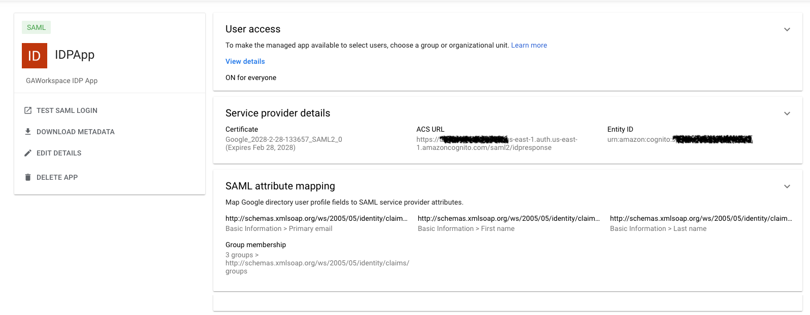

# **How to set up Google Workspace as a SAML identity provider with an Amazon Cognito user pool**

**Use these instructions to configure Google Workspace as a Security Assertion Markup Language 2.0 (SAML 2.0) identity provider (IdP) with an** [**Amazon Cognito user pool.**](https://docs.aws.amazon.com/cognito/latest/developerguide/cognito-user-identity-pools.html)

Amazon Cognito user pools allow sign-in through third party IdPs such as Google Workspace. For more information, see [Adding user pool sign-in through a third party](https://docs.aws.amazon.com/cognito/latest/developerguide/cognito-user-pools-identity-federation.html) and [adding SAML identity providers to a user pool](https://docs.aws.amazon.com/cognito/latest/developerguide/cognito-user-pools-saml-idp.html).

To set up Google Workspace as SAML IdP, you need an Amazon Cognito user pool and a Google Workspace account with an application.

## **Create an Amazon Cognito user pool**

For more information and instructions, see these articles:

- [Tutorial: creating a user pool](https://docs.aws.amazon.com/cognito/latest/developerguide/tutorial-create-user-pool.html)
- [Setting up the hosted UI with the Amazon Cognito Console](https://docs.aws.amazon.com/cognito/latest/developerguide/cognito-user-pools-app-integration.html#cognito-user-pools-create-an-app-integration)
- [Adding a domain name for your user pool](https://docs.aws.amazon.com/cognito/latest/developerguide/cognito-user-pools-domain.html)

**Note:** When creating a user pool, the standard attribute **email** is selected by default. For more information about user pool attributes, see [Configuring user pool attributes](https://docs.aws.amazon.com/cognito/latest/developerguide/user-pool-settings-attributes.html).

## **Create a Google Workspace account**

For more information, see the [Google Workspace website,](https://workspace.google.com/) and create a account.
## **Create Users and Groups in Google Workspace**
1) In your Google Admin console, go to Menu => Directory => Users to create users.
2) Follow the instrunction to create groups pet-app-admin and pet-app-user and assign users to these groups.
https://apps.google.com/supportwidget/articlehome?hl=en&article_url=https%3A%2F%2Fsupport.google.com%2Fa%2Fanswer%2F9400082%3Fhl%3Den&assistant_id=generic-unu&product_context=9400082&product_name=UnuFlow&trigger_context=a

## **Create a Google Workspace application**

1. Once you created users and assigned them to groups, choose **Web and mobile app** under **Apps** on the left side of the page, and click the **Add custom SAML app** under **Add app**.

     

2. Enter the App name and description and click continue.

3. Download IdP metadata as you will need it to configure Amazon Cognito and click Continue.

     

4. Next enter the ACS URL and Entity ID, both of which can be obtained from the Cognito User pool configuration, and then proceed by clicking on Continue.
     
     **ACS (Consumer) URL** sample: ```https://<yourDomainPrefix>.auth.region.amazoncognito.com/saml2/idpresponse```

     **Entity ID** sample: ```urn:amazon:cognito:sp:\<yourUserPoolId\>```
5. Select EMAIL from the drop down menu for **Name ID Format**.

6. Select Primary email from the drop down menu for **Name ID** and click Continue.

7. On the Attributes tab, click **ADD MAPPING** to add additional parameters to include in the SAML payload such as First Name, Last Name and Email. For the **App Attribute** enter ```http://schemas.xmlsoap.org/ws/2005/05/identity/claims/<ididentifier>```. 

     

8. Under Group Membership section select pet-app-user, pet-app-admin groups and assign them the to SAML attribute ```http://schemas.xmlsoap.org/ws/2005/05/identity/claims/groups```.

     

9. Click Finish to complete.
     

10. Once the application is created, Navigate to User access tab and set the service status as ON for everyone and click Save.

     

11. IDP setup is now complete, navigate to AWS Congito Console to complete the Cognito Configuration.
