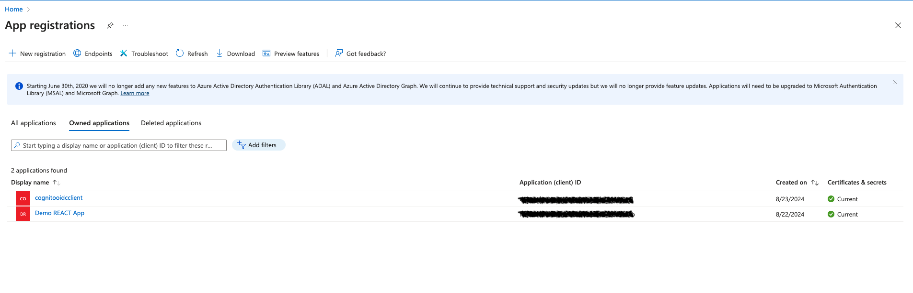
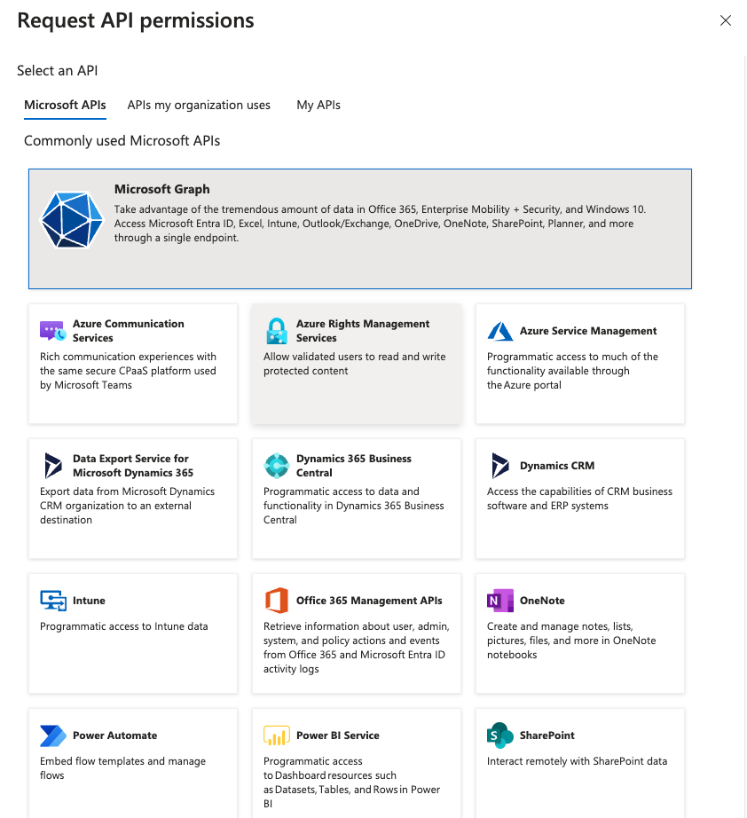
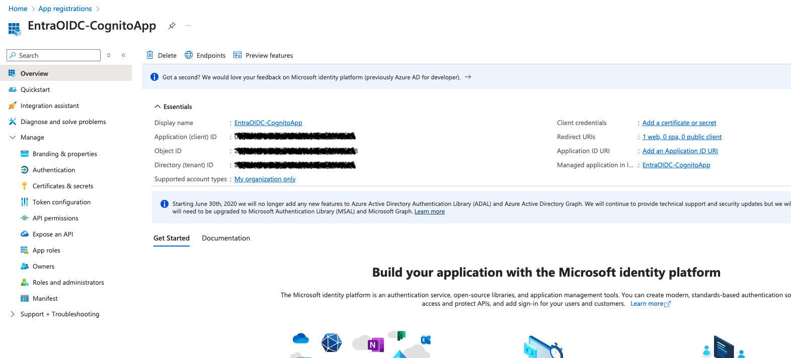

# Integrating IdP Sign In with Cognito

## Overview

This walkthrough will help guide you through creating a working Azure AD OIDC Prodiver to successfully run the demo. 

## Prerequisites

1. Sign up for a developer account on [Azure AD](https://azure.microsoft.com/free/?WT.mc_id=A261C142F) using your corporate credentials.
2. The account must be [Cloud Application Administrator](https://learn.microsoft.com/en-us/entra/identity/role-based-access-control/permissions-reference#cloud-application-administrator).
3. Complete the [tenant setup](https://learn.microsoft.com/en-us/entra/identity-platform/quickstart-create-new-tenant).


## Steps to Set Up Entra ID as an OIDC Provider

### Step 1: Register Your Application

1. **Log in to the Azure Portal**
   - Go to [Azure Portal](https://portal.azure.com).
   - Sign in with your admin account.

2. **Navigate to Azure Active Directory**
   - In the left sidebar, click on **Azure Active Directory**.

3. **Register a New Application**
   - Click on **App registrations**.
  
   

   - Click on **New registration**.
   


   - Enter the following details:
     - **Name**: Your application name.
     - **Supported account types**: Choose based on your needs (e.g., Accounts in this organizational directory only).
     - **Redirect URI**: Enter the URI where your application will receive the authentication response. For the purpose of this blog select **Web** from the dropdown and enter URL as **https://{{cognito domain}}/oauth2/idpresponse**

   

   - Click **Register**. Once application is created you will be navigated to **Overview screen**.

   

### Step 2: Configure Application Permissions

1. **API Permissions**
   - Select **API permissions** under **Manage** dropdown from the left menu.

   - Click on **Add a permission**.

   

   - Choose **Microsoft Graph**.

   

   - Select **Delegated permissions** and add the necessary permissions (e.g., `openid`, `profile`, `email`).

    

2. **Grant Admin Consent**
   - After adding permissions, click on **Grant admin consent for [Your Organization]**.


### Step 3: Token Configuration Settings
   - Click on **Token Configuration** under `Manage` dropdown to pass group information in ID Token.

   

   - Click on **Add groups claim** and select **Groups assigned to the application** as group type to include in ID Token. 

   

   - Expand ID Token type and select **sAMAccountName** and click **Add**.

   
   

### Step 3: Set Up Client Secret
   - Navigate to the **Certificates & secrets** section.

   

   - Click on **New client secret**.

   
   
   - Add a description `EntraID Secrets for CognitoApp` and set the expiration period.
   - Click **Add** and make sure to copy the secret value as it will be required for your application.

   


To configure OIDC settings in Cognito get the necessary information:
   - From your application overview, note down the following:
     - **Application (client) ID**
     - **Directory (tenant) ID**
     - **Client Secret**

   - The OIDC discovery document URL will typically be:
     ```
     https://login.microsoftonline.com/{tenant-id}/v2.0/.well-known/openid-configuration
     ```
   - Replace `{tenant-id}` with your Directory (tenant) ID.