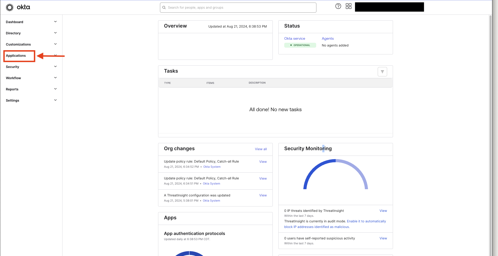
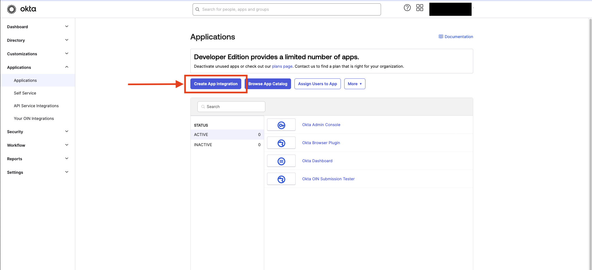
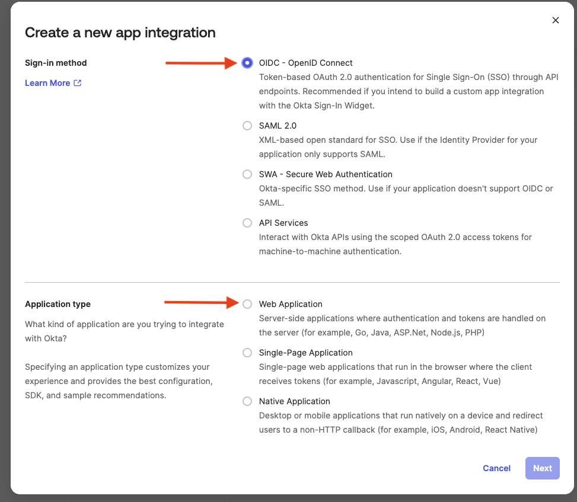
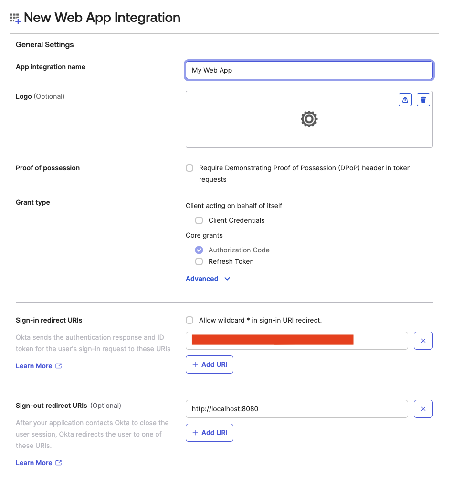
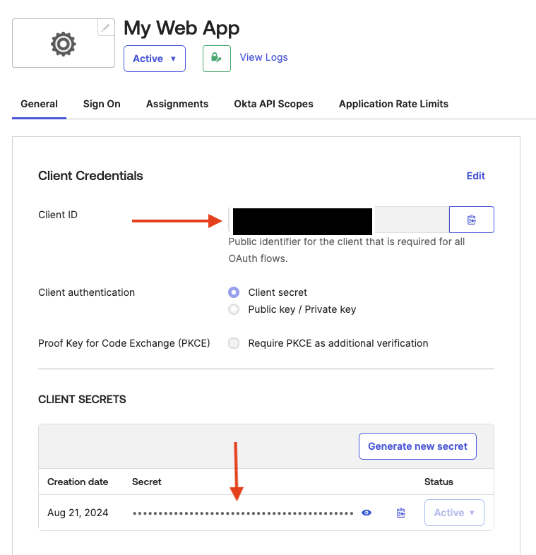
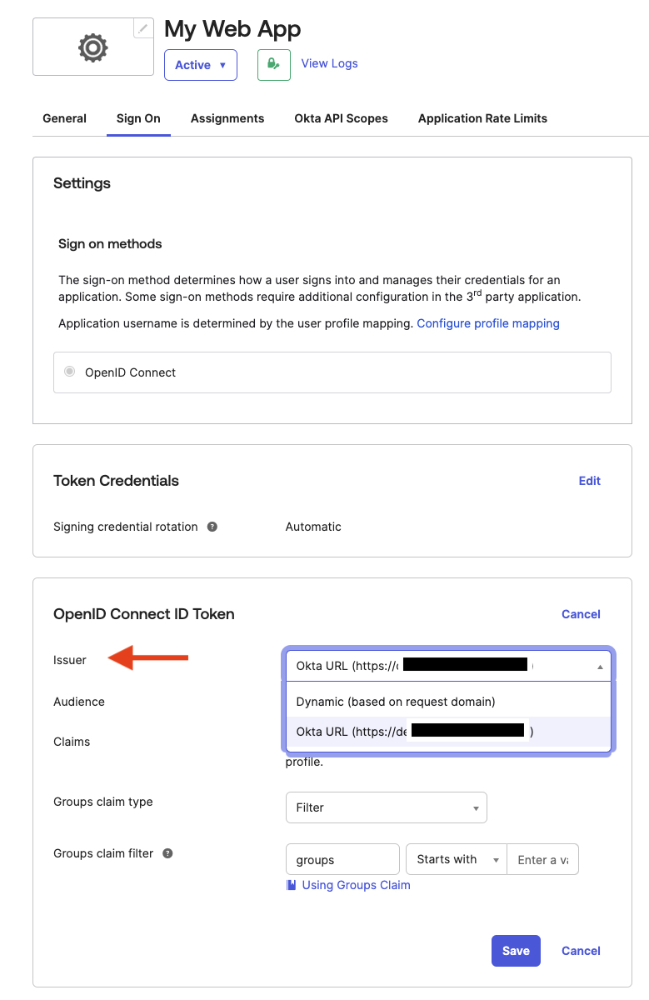

# Integrating IdP Sign In with Cognito

## Overview

This walkthrough will help guide you through creating a working Okta Application with OIDC in order to successfully run the demo. 

## Okta Directory and Application Setup

#### If you already have a developer account with Okta, please skip to Step 3

1. Sign up for a developer account on [Okta](https://developer.okta.com/) using your corporate credentials.
2. Activate your account and sign into your Okta domain *stated in the email*.
3. Open the Okta Developer Console.
4. In the navigation pane, expand Applications, and then choose **Applications**.

 

5. Choose **Create App Integration**..

6. On the Create a new app integration page, choose **OIDC - OpenID Connect**,Choose **Web Application**, and then choose **Next**.

7. On the **New Web App Integration page**, under **General Settings**, enter a name for your app and a logo (*optional*), for example **My Web APP**.
8. Verify that **Authorization Code** is selected under **Grant type**. This flow enables communication between your user pool and Okta OIDC for     federated sign-in.
9. Enter **https://myUserPoolDomain/oauth2/idpresponse** in the **Sign-in redirect URIs** field. Okta will send the authentication response and ID token to this address. Remember to replace **myUserPoolDomain** with your actual Amazon Cognito user pool domain.
10. For all other settings on the page, leave them as their default values or set them according to your preferences

11. Select your desired access setting under **Controlled access** and save your changes.
12. Make note of the **Client ID** and **Client secret** under **Client Credentials**. You'll need these to set up Okta in your Amazon Cognito user pool

13. In the **OpenID Connect ID Token** section of the **Sign On** page, take note of the **Issuer URL**. This information is necessary for configuring Okta in your user pool.

